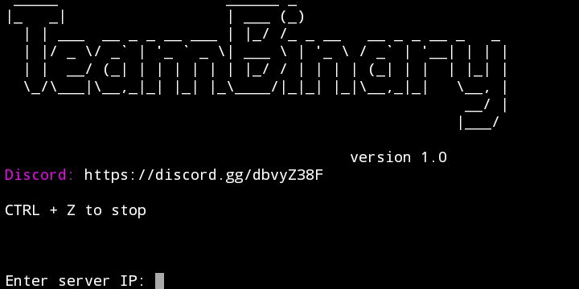

# TeamBinary DDoS Tool
version 1.0



## installation (Termux)

Download Termux:

https://play.google.com/store/apps/details?id=com.termux

Update Termux Packages

```bash
pkg update && pkg upgrade
```

```bash
pkg install git
```

```bash
pkg install python3
```

```bash
pkg install python-pip
```

```bash
git clone https://github.com/0101100111-Binary/TeamBinary-DDoS/
```

```bash
cd TeamBinary-DDoS
```

```bash
pip3 install -r requirements.txt
```

```bash
python3 TeamBinary-DDoS.py
```

## installation (Ubuntu/UserLand)

```bash
sudo apt update && apt upgrade
```

```bash
sudo apt install git
```

```bash
sudo apt install python3
```

```bash
sudo apt install python-pip
```

```bash
git clone https://github.com/0101100111-Binary/TeamBinary-DDoS/
```

```bash
cd TeamBinary-DDoS
```

```bash
pip3 install -r requirements.txt
```

```bash
python3 TeamBinary-DDoS.py
```

## It'll ask you this

```bash
Enter server IP:
Enter server port (default is 19132):
How many threads (bots): 
How long to run (in seconds):
```

Example:

```bash
Enter server IP: 127.0.0.1
Enter server port (default is 19132): 19132
How many threads (bots): 5
How long to run (in seconds): 100
```
